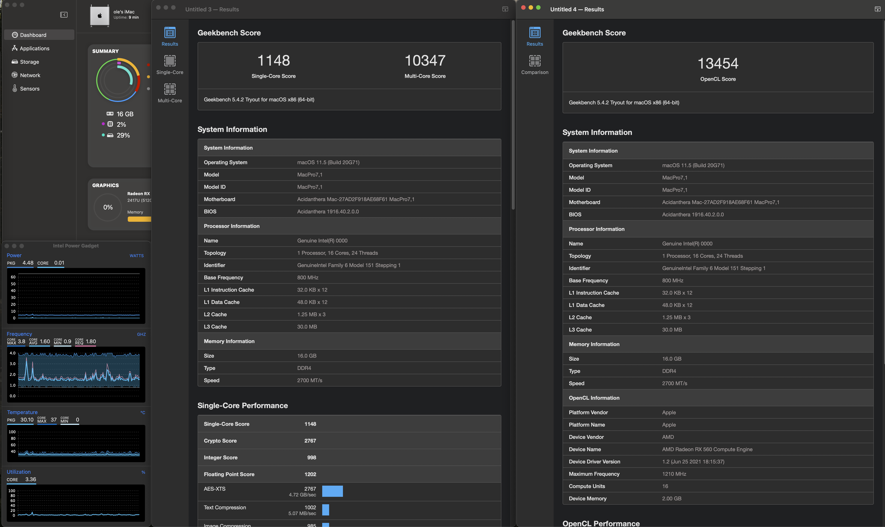
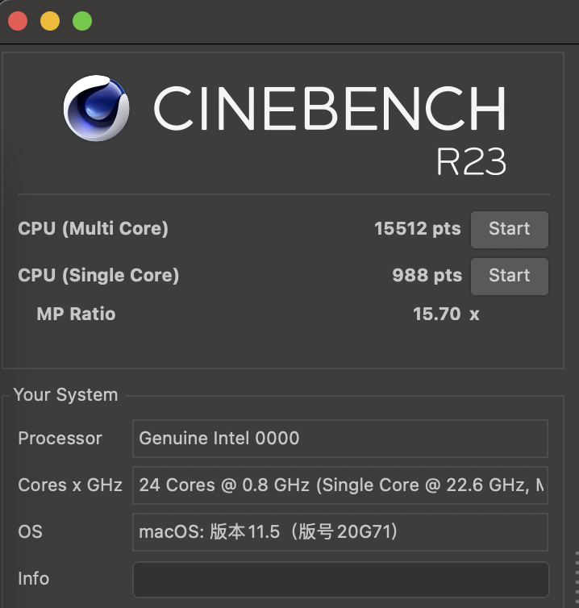
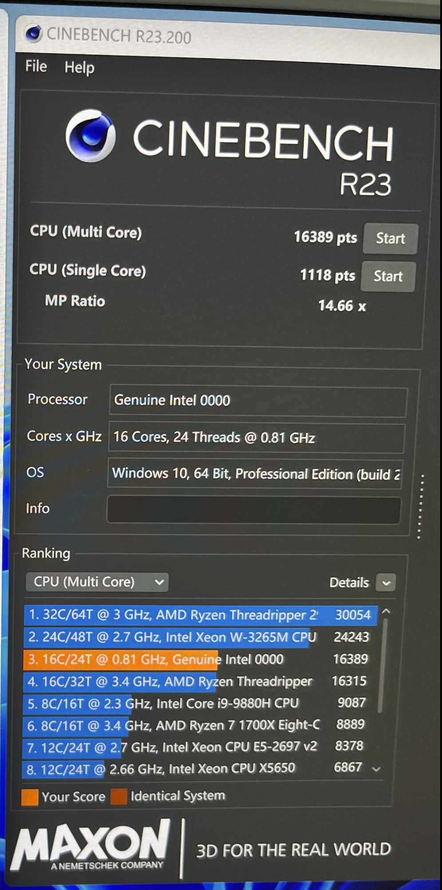
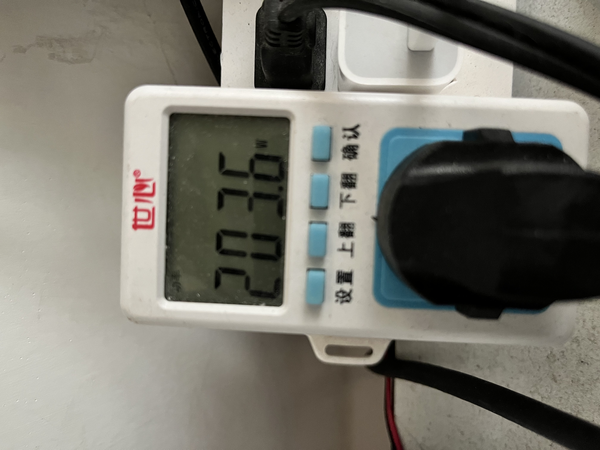

# 精粤B660m-QX7J-RX560

### 平台配置 Big Sur 11.5 (OC 0.8.5)
##### 一直使用此系统版本没有升级，理论上可以升级到新版。千元内的12代es加B660主板是12代以来最具有性价比的生产力工具了，昂达的bios，CPU最高电压1.1x伏不可调，总体温度功耗不高，在windows下cpuz单核550多核6500，geekbench5也有单核1100+多核10000+ 比我之前的10700+迫击炮还强，而且温度还低10度+
```
CPU qx7j(8p+8e,最高单核4G，全核3.4G 12900F低频版本？)
主板 精粤B660M-VDH
内存 Kingston 8G（2400-CL16） * 2
显卡 RX4602G版本刷华硕RX560BIOS
网卡 博通BCM943224PCIEBT2BX (淘宝63带pci卡，但是只有300M)
SSD A2000 500GB
```
### 机型
+ 选择MacPro7,1，WhateverGreen.kext可以弃用

## CPU仿冒
```
Cpuid1Data 55060A00 00000000 00000000 00000000
Cpuid1Mask FFFFFFFF 00000000 00000000 00000000
```

### 显卡
+ 12代ESbug默认第一个PCIE不可用，所以使用第二个开放式PCIEx4的插槽。华硕RX5602G版本bios直接免驱

### 声卡
+ layout-id=11

### 网卡
+ 无线网卡使用AirportBrcmFixup.kext之前需要对这个kext进行处理，不然会panic，这个我参考的这位大哥的视频 ! https://www.bilibili.com/video/BV1k64y1D738/ 主要移除了里面AirPortBrcm4360_Injector.kext
+ 有线网卡使用RealtekRTL8111-Mieze.kext

### USB
+ 定制USBPorts.kext

### 性能截图
+ 单核略差于10700，但是多核还是挺强。满载温度最高63度，功耗仪200w左右
+ mac跑分


+ windows11跑分

+ geekbench满载
